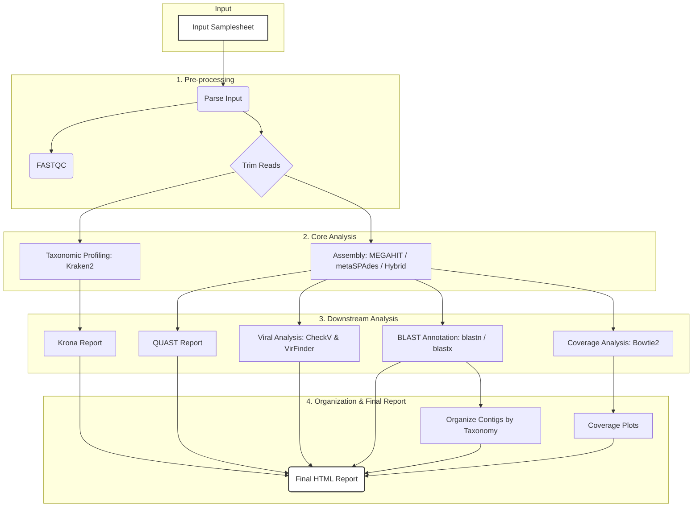

# MetaNextViro: High-Throughput Virus Identification and Metagenomic Analysis Pipeline

<p align="center">
  
</p>

[](https://github.com/navduhan/metanextviro/releases)
[](https://github.com/navduhan/metanextviro/blob/main/LICENSE)
[](https://github.com/navduhan/metanextviro/stargazers)
[](https://github.com/navduhan/metanextviro/network)
[](https://www.nextflow.io/)
[](https://www.docker.com/)
[](https://sylabs.io/singularity/)

<p align="center">
  metagenomics • virology • bioinformatics • nextflow • virus-discovery • metagenomic-assembly • taxonomic-classification • viral-analysis • coverage-analysis • checkv • virfinder • kraken2 • blast • docker • singularity • hpc • slurm
</p>

## Table of Contents

- [Overview](#overview)
- [Pipeline Schema](#pipeline-schema)
- [Quick Start](#quick-start)
- [Features](#features)
- [Key Improvements](#key-improvements)
- [Prerequisites](#prerequisites)
- [Installation](#installation)
- [Running the Pipeline](#running-the-pipeline)
- [Resource Management on SLURM](#resource-management-on-slurm)
- [Pipeline Steps](#pipeline-steps)
- [Output Structure](#output-structure)
- [Key Output Files](#key-output-files)
- [Configuration](#configuration)
- [Docker & Singularity Support](#docker--singularity-support)
- [Citations](#citations)
- [Support](#support)
- [License](#license)
- [Authors](#authors)

## Overview

MetaNextViro is a robust, modular Nextflow pipeline designed primarily for **virus identification and characterization** from metagenomic sequencing data. While it also supports bacterial profiling, its main focus is on the detection, classification, and annotation of viral sequences in complex samples such as environmental, clinical, or animal/human microbiome datasets.

The pipeline integrates state-of-the-art tools for:
- **Quality control and preprocessing** of raw reads (FastQC, fastp, flexbar, trim_galore)
- **Assembly** of metagenomic data (MEGAHIT, metaSPAdes, or hybrid)
- **Taxonomic classification** with Kraken2 and visualization with Krona
- **Viral genome completion and quality assessment** (CheckV)
- **Viral sequence identification** (VirFinder with custom filtering)
- **BLAST-based annotation** for both viral and bacterial contigs
- **Automated organization of contigs** by taxonomy and family
- **Contig-level coverage analysis and visualization** for assembled contigs
- **Comprehensive reporting** with coverage plots and an interactive HTML summary

MetaNextViro is suitable for:
- Discovery of known and novel viruses in metagenomic samples
- Viral diversity and abundance profiling
- Viral genome recovery and annotation
- Comparative virome analysis across samples or conditions
- Integrated viral and bacterial community profiling (optional)

The pipeline is highly portable and reproducible, supporting Conda, Docker, and Singularity environments, and can be run on local workstations, HPC clusters (SLURM), or in the cloud. It is ideal for virome research, outbreak investigations, environmental surveillance, and any project requiring robust viral metagenomics.

## Pipeline Schema




## Quick Start

### Prerequisites
- Nextflow (>=21.10.3)
- Java (>=8)
- Conda, Docker, or Singularity

### Basic Usage
```bash
# Clone the repository
git clone https://github.com/navduhan/metanextviro.git
cd metanextviro

# Run with conda (recommended for first-time users)
nextflow run main.nf \
  --input <your_samplesheet>.csv \
  --outdir <output_directory> \
  --kraken2_db <path_to_your_kraken2_db> \
  --checkv_db <path_to_your_checkv_db> \
  -profile conda

# Run with singularity (recommended for HPC)
nextflow run main.nf \
  --input <your_samplesheet>.csv \
  --outdir <output_directory> \
  --kraken2_db <path_to_your_kraken2_db> \
  --checkv_db <path_to_your_checkv_db> \
  -profile singularity,slurm
```

### Sample Input Format
Create a `samplesheet.csv` file:
```csv
sample,fastq_1,fastq_2
sample1,/path/to/sample1_R1.fastq.gz,/path/to/sample1_R2.fastq.gz
sample2,/path/to/sample2_R1.fastq.gz,/path/to/sample2_R2.fastq.gz
```

## Features

- Quality control and adapter/quality trimming (FastQC, fastp, flexbar, trim_galore)
- Multiple assembly options (MEGAHIT, metaSPAdes, or hybrid)
- BLAST-based and Kraken2-based taxonomic annotation
- **Flexible BLASTX tool choice** (DIAMOND or traditional BLASTX)
- Automated organization of contigs by taxonomy and family
- Viral genome completion (CheckV) and classification (VirFinder with custom filtering)
- **Contig-level coverage analysis** and visualization
- **Modern, Template-Based Final Report** with a clean and interactive design.
- Structured, per-sample output organization

## Key Improvements

### Enhanced VirFinder Analysis
- **Custom R script** (`run_virfinder.R`) for improved control over filtering criteria
- **Dual output format**: Full results and high-confidence filtered results (score ≥ 0.9, p-value ≤ 0.05)

### Improved Coverage Analysis
- **Contig-level coverage calculation** instead of nucleotide-level depth
- **Custom bash script** (`calculate_contig_coverage.sh`) for efficient processing

### Modern Final Report
- **Template-Based**: Report is generated using a Nextflow template, making it robust and easy to modify.
- **Clean Design**: Features a modern, card-based layout for easy navigation.
- **Guaranteed Completion**: Generated only after all pipeline steps are finished.

## Prerequisites

- Nextflow (>=21.10.3)
- Java (>=8)
- Python (>=3.8)
- Conda (recommended)
- Docker or Singularity (optional, for containerized execution)

### Required Tools and Packages
All dependencies can be installed using the provided `environment.yml` file or automatically with the conda profile.

- FastQC, fastp, flexbar, trim-galore
- MEGAHIT, SPAdes, BLAST+, DIAMOND, Kraken2, QUAST
- Bowtie2, Samtools, Bedtools
- CheckV, VirFinder (R)
- Python: biopython, pandas, matplotlib, seaborn, ete3
- R: r-base, r-virfinder

## Installation

1. **Clone the repository:**
   ```bash
   git clone https://github.com/navduhan/metanextviro.git
   cd metanextviro
   ```

2. **Create and activate the conda environment (platform-specific):**

| Platform                | Command to Use                                      |
|-------------------------|-----------------------------------------------------|
| **Linux**               | `conda env create -f environment.yml`               |
| **Intel/AMD Mac**       | `conda env create -f environment.yml`               |
| **Apple Silicon (M1/M2)** | `CONDA_SUBDIR=osx-64 conda env create -f environment.yml` |

- **Linux and Intel/AMD Macs:**
  ```bash
  conda env create -f environment.yml
  conda activate metanextviro
  ```

- **Apple Silicon (M1/M2) Macs:**
  ```bash
  CONDA_SUBDIR=osx-64 conda env create -f environment.yml
  conda activate metanextviro
  ```
  This tells conda to install Intel-compatible binaries, which work via Rosetta 2 on Apple Silicon.

Or let Nextflow manage it automatically with `-profile conda`.

## Running the Pipeline

### With Conda (Recommended, Nextflow-managed)
Nextflow can automatically manage all dependencies using the conda profile:
```bash
nextflow run main.nf --input <your_samplesheet>.csv --outdir <output_dir> -profile conda
```

### With Docker / Singularity (Recommended for HPC)
For maximum reproducibility, especially on an HPC, it is recommended to use Docker or Singularity.

1. **Build the Docker image (optional):**
   ```bash
   docker build -t metanextviro:latest .
   ```

2. **Run with Singularity and SLURM:**
   ```bash
   nextflow run main.nf \
     --input <your_samplesheet>.csv \
     --outdir <output_dir> \
     --kraken2_db <path_to_kraken2_db> \
     --checkv_db <path_to_checkv_db> \
     -profile singularity,slurm
   ```
   Nextflow will automatically pull the Docker image and convert it to a Singularity image.

### Parameters
All parameters can be set on the command line or in `nextflow.config`.

| Parameter           | Description                                                        | Default           |
|---------------------|--------------------------------------------------------------------|-------------------|
| --input             | Path to input samplesheet (CSV)                                    | (required)        |
| --outdir            | Output directory                                                   | ./results         |
| --adapters          | Path to adapters file (for trimming)                              | (provided)        |
| --trimming_tool     | Trimming tool: `fastp`, `flexbar`, `trim_galore`                  | `trim_galore`     |
| --assembler         | Assembler: `megahit`, `metaspades`, `hybrid`                      | `hybrid`          |
| --kraken2_db        | Path to Kraken2 database                                           | (required)        |
| --blastdb_viruses   | Path to BLAST viruses database                                    | (optional)        |
| --blastdb_nt        | Path to BLAST nt database                                         | (optional)        |
| --blastdb_nr        | Path to BLAST nr database                                         | (optional)        |
| --diamonddb         | Path to DIAMOND protein database                                  | (optional)        |
| --blastx_tool       | BLASTX tool: `diamond`, `blastx` (DIAMOND is much faster)         | `diamond`         |
| --checkv_db         | Path to CheckV database (for viral genome completion)             | (required)        |
| --min_contig_length | Minimum contig length for assembly                                | 200               |
| --quality           | Quality threshold for trimming                                    | 30                |
| --profile           | Nextflow profile (e.g., `local`, `slurm`, `conda`, `docker`)      | `slurm`           |
| --help              | Show help message and exit                                        |                   |

## Resource Management on SLURM

The pipeline is configured to be efficient on HPC systems using a SLURM executor. Instead of requesting large resources for every job, it uses a label system to assign resources based on the task's requirements.

The defined labels in `nextflow/configs/slurm.config` are:

| Label     | CPUs | Memory  | Default Time | Use Case                               |
|-----------|------|---------|--------------|----------------------------------------|
| `low`     | 10   | 50 GB   | 8h           | QC, trimming, reporting, etc.          |
| `medium`  | 25   | 100 GB  | 12h          | Lighter alignments, viral analysis.    |
| `high`    | 40   | 200 GB  | 24h          | Heavy assembly, large database BLAST.  |
| `vhigh`   | 40   | 250 GB  | 48h          | Very memory-intensive assembly (metaSPAdes). |

Any process without a label receives a minimal default of 2 CPUs, 8 GB of RAM, and a 4-hour time limit to prevent resource waste.

## Pipeline Steps

1. **Input Parsing**
   - Validates input files and sample sheet
2. **Preprocessing**
   - FastQC on raw reads
   - Adapter/quality trimming (fastp, flexbar, or trim_galore)
   - FastQC on trimmed reads
3. **Taxonomic Profiling**
   - Kraken2 classification
   - Krona visualization
4. **Assembly**
   - MEGAHIT, metaSPAdes, or hybrid assembly
   - QUAST quality assessment
5. **BLAST Annotation**
   - Taxonomic annotation of contigs against multiple databases (NT, NR, viruses)
6. **Viral Analysis**
   - CheckV genome completion
   - VirFinder classification with custom filtering
7. **Contig Organization**
   - Organize contigs by taxonomy and family using NT database results
8. **Coverage Analysis**
   - Contig-level coverage calculation and statistics
   - Enhanced coverage plots with intelligent x-axis labeling
9. **Final Report Generation**
   - A comprehensive and modern HTML summary report is generated using a Nextflow template.

## Output Structure

```
results/
├── fastp/                # Trimmed reads and fastp reports
├── fastqc/               # Raw and trimmed read QC reports
├── assembly/             # Assembly results
├── assembly_stats/       # Assembly quality assessment (QUAST)
├── blast_results/        # BLAST annotation results
├── kraken2_results/      # Kraken2 classification results
├── krona_results/        # Krona HTML visualizations
├── organized_contigs/    # Organized contigs by taxonomy
├── checkv/               # CheckV viral genome completion
├── virfinder/            # VirFinder results (full and filtered)
├── coverage/             # BAM files and contig-level coverage stats
├── coverage_plots/       # Coverage plots (PNG)
├── final_report/         # Comprehensive HTML report (final step)
└── ...                   # Other outputs as configured
```

## Key Output Files

### Final Report
- `final_report.html`: A comprehensive and modern HTML summary report. It includes:
  - A clean, card-based layout for easy navigation.
  - Direct links to key results from all major pipeline steps.
  - A summary of the run and a timestamp.

### VirFinder Results
- `virfinder_full_*.txt`: Complete VirFinder results for all contigs
- `virfinder_filtered_*.txt`: High-confidence viral contigs (score ≥ 0.9, p-value ≤ 0.05)

### Coverage Analysis
- `coverage_*.txt`: Contig-level coverage statistics.
- `coverage_plot_*.png`: Bar plots showing coverage distribution across contigs.

## Configuration

- `nextflow.config`: Main configuration file.
- `environment.yml`: Conda environment for all dependencies.
- `Dockerfile`: (Optional) Build your own container for full reproducibility.
- `nextflow/bin/`: Custom scripts and templates for enhanced functionality.

## Docker & Singularity Support

- **Docker:** Use the provided Dockerfile to build an image for full reproducibility.
- **Singularity:** On HPC, use the `singularity` profile. Nextflow will automatically convert the Docker image on the fly.

### Example (HPC with SLURM and Singularity)
```bash
nextflow run main.nf --input <samplesheet> --outdir <results> -profile slurm,singularity
```

## Citations

If you use this pipeline, please cite:

- **MetaNextViro Pipeline**: [https://github.com/navduhan/metanextviro](https://github.com/navduhan/metanextviro)
- **Nextflow**: Di Tommaso, P., Chatzou, M., Floden, E. W., Barja, P. P., Palumbo, E., & Notredame, C. (2017). Nextflow enables reproducible computational workflows. Nature Biotechnology, 35(4), 316-319. [https://doi.org/10.1038/nbt.3820](https://doi.org/10.1038/nbt.3820)
- **FastQC**: Andrews, S. (2010). FastQC: a quality control tool for high throughput sequence data. [https://www.bioinformatics.babraham.ac.uk/projects/fastqc/](https://www.bioinformatics.babraham.ac.uk/projects/fastqc/)
- **MEGAHIT**: Li, D., Liu, C. M., Luo, R., Sadakane, K., & Lam, T. W. (2015). MEGAHIT: an ultra-fast single-node solution for large and complex metagenomics assembly via succinct de Bruijn graph. Bioinformatics, 31(10), 1674-1676. [https://doi.org/10.1093/bioinformatics/btv033](https://doi.org/10.1093/bioinformatics/btv033)
- **SPAdes**: Bankevich, A., Nurk, S., Antipov, D., Gurevich, A. A., Dvorkin, M., Kulikov, A. S., ... & Pevzner, P. A. (2012). SPAdes: a new genome assembly algorithm and its applications to single-cell sequencing. Journal of Computational Biology, 19(5), 455-477. [https://doi.org/10.1089/cmb.2012.0021](https://doi.org/10.1089/cmb.2012.0021)
- **Kraken2**: Wood, D. E., Lu, J., & Langmead, B. (2019). Improved metagenomic analysis with Kraken 2. Genome Biology, 20(1), 1-13. [https://doi.org/10.1186/s13059-019-1891-0](https://doi.org/10.1186/s13059-019-1891-0)
- **CheckV**: Nayfach, S., Camargo, A. P., Schulz, F., Eloe-Fadrosh, E., Roux, S., & Kyrpides, N. C. (2021). CheckV assesses the quality and completeness of metagenome-assembled viral genomes. Nature Biotechnology, 39(5), 578-585. [https://doi.org/10.1038/s41587-020-00774-7](https://doi.org/10.1038/s41587-020-00774-7)
- **VirFinder**: Ren, J., Ahlgren, N. A., Lu, Y. Y., Fuhrman, J. A., & Sun, F. (2017). VirFinder: a novel k-mer based tool for identifying viral sequences from assembled metagenomic data. Microbiome, 5(1), 1-20. [https://doi.org/10.1186/s40168-017-0283-5](https://doi.org/10.1186/s40168-017-0283-5)
- **BLAST**: Altschul, S. F., Gish, W., Miller, W., Myers, E. W., & Lipman, D. J. (1990). Basic local alignment search tool. Journal of Molecular Biology, 215(3), 403-410. [https://doi.org/10.1016/S0022-2836(05)80360-2](https://doi.org/10.1016/S0022-2836(05)80360-2)
- **Bowtie2**: Langmead, B., & Salzberg, S. L. (2022). Fast gapped-read alignment with Bowtie 2. Nature Methods, 9(4), 357-359. [https://doi.org/10.1038/nmeth.1923](https://doi.org/10.1038/nmeth.1923)
- **Samtools**: Li, H., Handsaker, B., Wysoker, A., Fennell, T., Ruan, J., Homer, N., ... & Durbin, R. (2009). The Sequence Alignment/Map format and SAMtools. Bioinformatics, 25(16), 2078-2079. [https://doi.org/10.1093/bioinformatics/btp352](https://doi.org/10.1093/bioinformatics/btp352)
- **Krona**: Ondov, B. D., Bergman, N. H., & Phillippy, A. M. (2011). Interactive metagenomic visualization in a Web browser. BMC Bioinformatics, 12(1), 1-10. [https://doi.org/10.1186/1471-2105-12-385](https://doi.org/10.1186/1471-2105-12-385)

## Support

For issues, questions, or suggestions:
- Create an issue on GitHub
- Contact: naveen.duhan@outlook.com

## License

This project is licensed under the MIT License - see the [LICENSE](LICENSE) file for details.

For more information about the MIT License, visit: https://opensource.org/licenses/MIT

## Authors

- Naveen Duhan
- [Other contributors]
